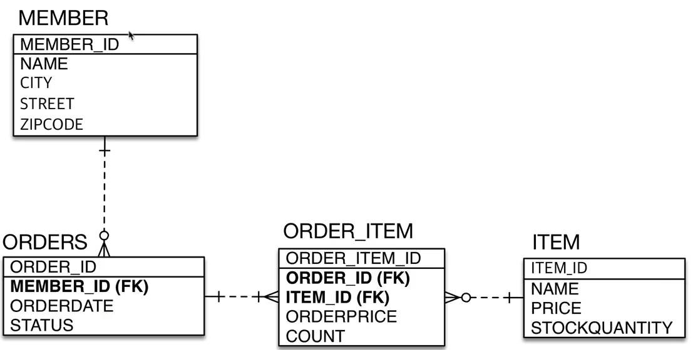

### JPA 실습 내용

---
1. 요구사항
- 회원은 상품을 주문 할 수 있다.
- 주문 시 여러 종류의 상품을 선택할 수 있다.

 

2. 기능 목록
- 회원 기능 ( 등록, 조회 )
- 상품 기능 ( 등록, 조회, 수정 )
- 주문 기능 ( 주문, 주문 내역 조회, 취소 )

 

3. 도메인 모델 분석
- 회원은 여러번 주문이 가능하다 ( 회원과 주문은 1 : N 의 관계 )
- 주문을 할 때 여러 상품을 선택 할 수 있다. 반대로 같은 상품 또한 여러 번 주문이 가능하다 ( 상품과 주문은 N : N의 관계 )
  

 